# Hi there! 👋

---

## 🤖 About Me

**AI Engineer** building production-grade ML systems and intelligent infrastructure.

**Location:** 📍 Hyderabad, Telangana, India  
**Focus:** LLMs, RAG Systems, ML Pipelines, AI Automation

---

## 🛠️ Tech Stack

**Languages:** Python, JavaScript, TypeScript  
**ML/AI:** PyTorch, TensorFlow, LangChain, Hugging Face  
**Cloud:** AWS, GCP, Docker, Kubernetes  
**Databases:** PostgreSQL, MongoDB, Redis, Pinecone

---

## 🚀 Featured Projects

### Custom Dependency Bot
Automated dependency management system that:
- ✅ Checks for outdated packages weekly
- ✅ Runs security vulnerability scans
- ✅ Generates detailed update reports
- ✅ Creates pull requests automatically

**Tech:** Node.js, GitHub Actions, npm audit

[View the bot code →](./scripts/dependency-bot.js)

### Dynamic Profile (This!)
Real-time GitHub profile with:
- 🌤️ Live weather updates (Hyderabad)
- 🕐 Current day/time information
- 🔄 Automated daily regeneration
- 🎨 SVG-based chat interface

**Tech:** Node.js, PirateWeather API, WorldTimeAPI, GitHub Actions

[View the build script →](./build-svg.js)

---

## 📊 GitHub Stats

---

## 📫 Connect With Me

**GitHub:** [@vivek-541](https://github.com/vivek-541)  
**Email:** vivekchary541@gmail.com  
**Twitter:** [@VivekCharyA](https://twitter.com/VivekCharyA)
**Location:** Hyderabad, Telangana, India

---

  
    🤖 This profile is automatically updated daily with live data 
    ⚙️ Powered by custom automation & GitHub Actions
  

# Trigger workflow
